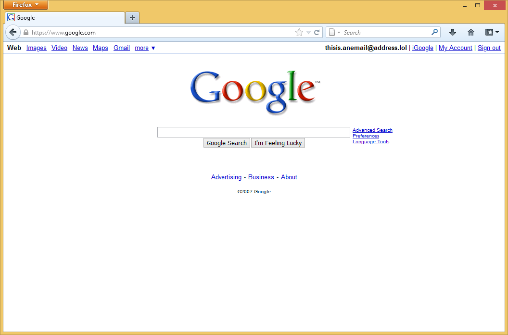
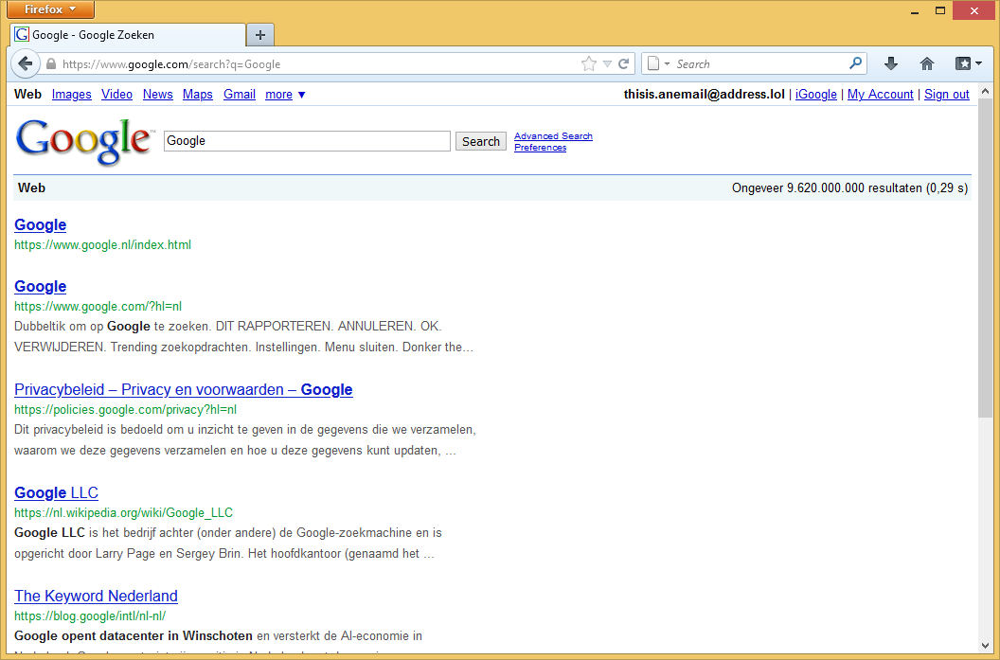
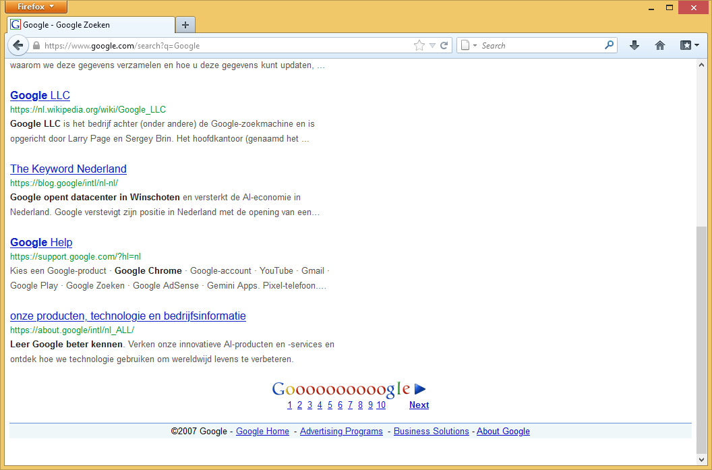

# GPlex2007
Google 2007 Theme for GPlex

Main style: [gplex2007.user.css](https://github.com/Ebeiw123/GPlex2007/raw/refs/heads/main/gplex2007.user.css)

## REQUIRED:
Gplex: https://greasyfork.org/en/scripts/492193-gplex-old-google-frontend

Layout: 2011-2012 

Script to make buttons native: [gplex2007bb.user.js](https://github.com/Ebeiw123/GPlex2007/raw/refs/heads/main/gplex2007bb.user.js)

Display name: Email (if not using CalyHam's GBar)

## OPTIONAL:
CalyHam's GBar: https://github.com/CallyHam/Google-Gbar/ 
1999-2008 Favicon: https://greasyfork.org/en/scripts/585942-google-favicon-1999-2008
GPlex with accurate footer links [gplex_accurate.user.js](https://github.com/Ebeiw123/GPlex2007/raw/refs/heads/main/gplex_accurate.user.js)

## MORE INFO:
This is my version of [GPlex2009](https://github.com/clockiscool1234/GPlex2009), but instead of 2009 I'm aiming to recreate the 2007-2008 look of Google Search.  
Some things might be a little inaccurate/broken, for example the footer on the search pages are probably not very accurate.
I wasn't able to find much imagery for stuff like that so I made use of what I was able to find (if you have any screenshots or know where to find them it would be helpful to let me know.
I'm also quite new to userstyles,so I'll keep learning along the way. 

Credits to [clockiscool1234](https://github.com/clockiscool1234) for the original project and [Lightbeam24](https://github.com/lightbeam24) for GBar

And have fun reliving 2007 Google!
